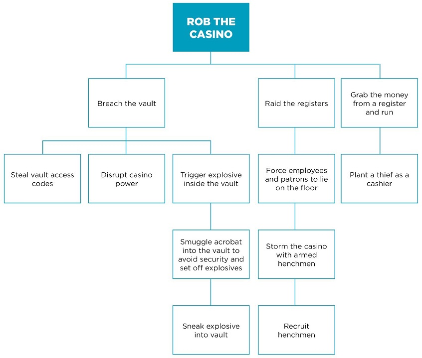
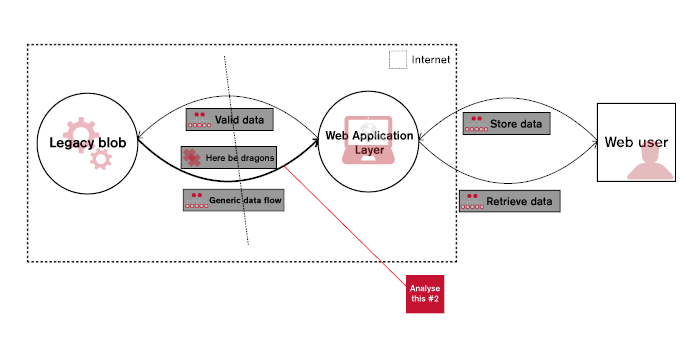

+++
title = "Threat Modelling"
summary = "Slides used for OWASP chapter talk in 2019"
date = 2020-05-25T15:43:41Z
layout = "bundle"
outputs = ["Reveal"]

[reveal_hugo]
	theme = "moon"
	transistion = "zoom"
	slide_number = "c/t"
	embedded = true
+++

# What Could Possibly Go Wrong?

Threat Modelling in the 21st Century

{}
{}

---

# TL;DR

 * What is a threat model?
 * Why should we have one?
 * How should we make one?
 * When should we do that?
 * How do we know when we’re done?
 * Does cloud change everything?

{}
{}

---

# Threat Model(l)ing

 * Spot quiz :)

{}
 * Start with a quick show of hands..
 * Heard of it?
 * Done it?
 * More than once?
 * I’ve found it’s rare that organisations do this,
 * instead they cargo cult infosec voodoo,
 * usually at higher cost and lower effectiveness.
{}

---

# WAT?

{}
{}

---

# An Attackers View of Your System

 * Their ‘business plan’ to attack your system at lowest risk and highest return on investment.

{}
 * Prediction document with explanations, costs & impacts.
 * Informed by threat intelligence, system knowledge & security testing knowledge of author(s).
 * Attempts to quantify threats in business terms (usually money) within a power of 10.
 * Often using cost/impact ratios
{}

---

# In Context..

 * Threat Model →
 * Risk Assessment →
 * Risk Management →
 * System Development Life Cycle (SDLC) →
 * Regulatory Compliance (ISO27k, PCI-DSS, GDPR)
 * Or because you want to stay in business :)

{}
 * → means ‘is part of’
 * Risk assessments can be one pagers
 * Risk management has more standards (ISO31k)
 * Risk appetite is crucial, usually poorly expressed :(
 * System, not Software ([PS]aaS & ops here for the ride).
 * Biggest impact usually to reputation, long term.
 * 
{}

---

# AKA..

 * Gartner’s ‘Adaptive Security Architecture’ (BS!)
 * Predict, Prevent, Detect, Respond (PPDR) →
 * Resilience modelling

{}
 * In the wider risk management context..
 * Resilience modelling from Kelly Shortridge et al.
{}

---

# WHY?

{}
{}

---

# Effective Security

 * Well understood
 * Managed risks
 * Planned responses

{}
 * Fewer gaps in understanding of threats
 * Quantified risks we can choose to act on
 * Less guesswork in security control design
 * No Cargo Cults or Voodoo security magic!
{}

---

# Efficient Security

 * Prioritised, cost effective controls
 * Estimates of residual risk in business terms
 * Ready made evidence for compliance audits

{}
 * Prioritised against risk appetite
 * Only treat risks/threats that you have
 * Excellent starting point for PCI-DSS, SOC-II and GDPR.
{}

---

# HOW?

{}
{}

---

# “Think Like an Attacker”

 * Build a model of attacks
 * Estimate cost to attacker
 * Estimate impact to our business
 * Prioritise threats on highest impact/cost ratio
 * Take into risk assessment, control design..

{}
 * Remember it’s an attackers business plan, so..
 * ...
 * ‘Bulid a model’, two approaches are popular..
{}

---

# Outside In Modelling

 * Threat actors, motivations
 * Target data and flows across..
 * Boundaries.
 * ‘Crown Jewels’ model

{}
 * Typically used in data-centric systems (most)
 * Starts with the data (target) of interest to actors (intel, standard classes).
 * Data is classified (eg: PII, CHD)
 * Dataflow is drawn up (should be in design docs!)
 * Boundaries defined by ownership/responsibility/capabilities.
 * Large systems can be unwieldy..
 * 
{}

---

# Inside Out Modelling

 * Components
 * Weaknesses
 * Networks
 * Microsoft STRIDE

{}
 * Typically used in availability focused, large systems or grey box systems (later!)
 * Components: yours and all 3rd party parts (cloud too!)
 * Weaknesses: documented (CVE), discovered (testing – usually your code)
 * Networks: logic between components, and physical to see possibly tapping threats.
 * Can result in over-engineering as not based on intel (although can be applied to outcomes)
 * Faster and typically easier for smaller teams with less security testing knowledge.
 * 
{}

---

# Samples!

{}
{}

---

# Attack Trees

 * Created by Bruce Schneier in 1999
 * Common in Outside In models
 * Effective when system is a well understood ‘White Box’

{}
 * Possibly popularised, not created :)
 * Amenable to automation/tooling
 * Immediate cost model too.
 * 
{}

---

{}
 * Silly example I found on the ‘net – the attackers goal is at the top, their actions are derived below by asking ‘and how do we get there?’
 * AND / OR relationships can be expressed as logic symbols
 * Risk and cost to attacker at each action.
 * Impact to business at goal.
 * 
{}

---

# Iterative Refinement

 * Created by NCC during consulting work
 * Common in Inside Out models
 * ‘Can’t make it worse’ principle :)
 * Copes with less well understood ‘Grey Box’ systems

{}
 * Search for magic words to read decent papers :)
 * Some model is better than no model.
 * ‘Grey box’ - where you don’t know all the parts, typically starting with a legacy ‘black box’ that is being enhanced by bolting on warts^H^Hexternal parts.
{}

---

{}
 * Sample from NCC
 * Black box legacy on the left
 * Adding web front end, what could possibly go wrong questions, usually focused on data flows.
 * Can apply STRIDE to new components.
 * 
{}

---

# WHEN?

{}
{}

---

# Greenfield: Part of the SDLC

 * First model → during first design cycle!
 * Refreshed → material changes in…
   * System functionality or implementation
   * External threat intelligence

{}
 * Not sure I like the ‘greenfield’ building metaphor..
 * As mentioned in Context – part of SDLC, BAU.
 * What’s a material change? Up to you, but typically related to Semver numbering: anything above patch changes.
{}

---

# Brownfield: Introduce to the SDLC

 * As soon as possible within SDLC
 * Always better to have a model than nothing!
 * Provides risk information to system owners
 * Incremental modelling reduces impact of introduction

{}
 * Make it BAU, ‘cant make it worse’ principle again!
 * Can make it quick (use Inside→Out/STRIDE)
 * Can use incremental approach to spread work.
{}

---

# DONE?

{}
{}

---

# Model Contains..

 * Quantified risks
 * Testable attacks
 * Operational impacts

{}
 * informs security control designs & incident response plans
 * informs security testing designs
 * informs detection designs & incident response plans
{}

---

# Model Checking

 * Security Testing
   * Red / Blue teaming
   * Purple teaming
 * Operational feedback
   * Monitoring behaviour

{}
 * R/B: formal, effective, good for deployed systems
 * P: agile, fewer barriers to start, good for early life cycle stages – use to build attack model
 * OP: Critical to measure reality and learn what’s really happening, OR what isn’t (wasted resource)
{}

---

# CLOUD?

{}
{}

---

# Can we SEP it?

 * Somebody Else’s Problem: AWS/Google/Microsoft?
 * Nope!
   * Your architecture, your choice of components, your code
   * New actors & risks
   * New controls though :)

{}
 * Somebody Else’s Problem – Google can fix it, you can relax.. I wish!
 * Actors: now include cloud company, staff and suppliers
 * Attack routes: shared systems, misconfiguration
 * Controls: Distributed, Immutable, Ephemeral.
 * 
{}

---

# ME :)

 * Phil Ashby (aka Phlash)
 * Technical Architect @ GBG Plc.
 * Ex-BT security, ex-CEH holder
 * AMCIISec, MBCS, MIET
 * phil.owasp@ashbysoft.com
 * https://twitter.com/phlash909
 * https://dev.to/phlash909

{}
{}

---

# YOU?

 * Questions?

{}
{}
